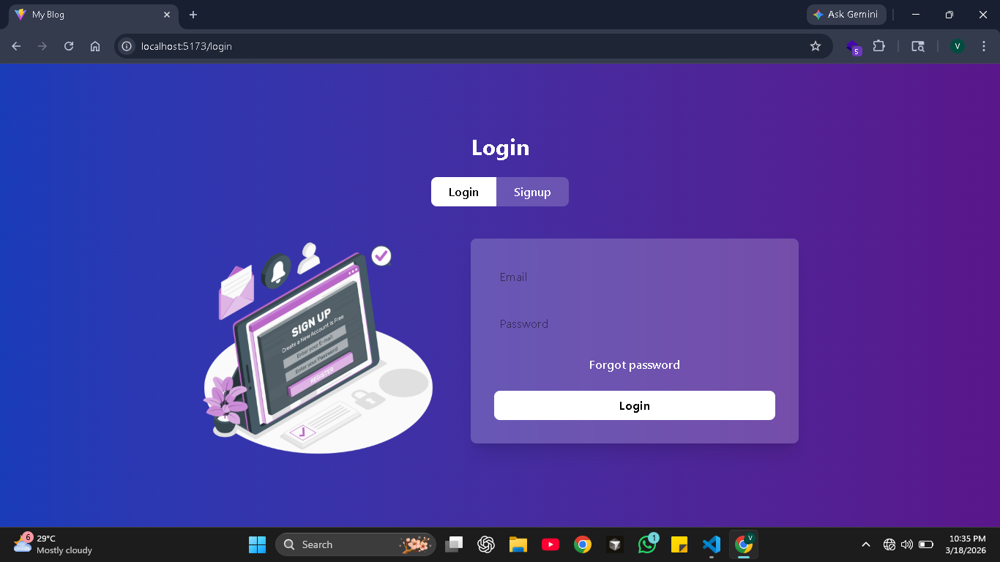
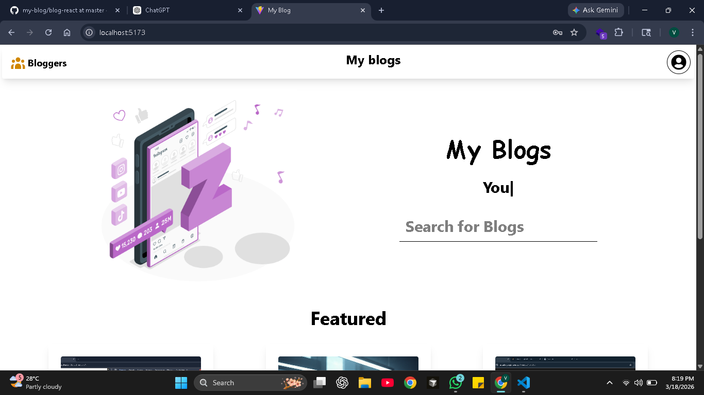
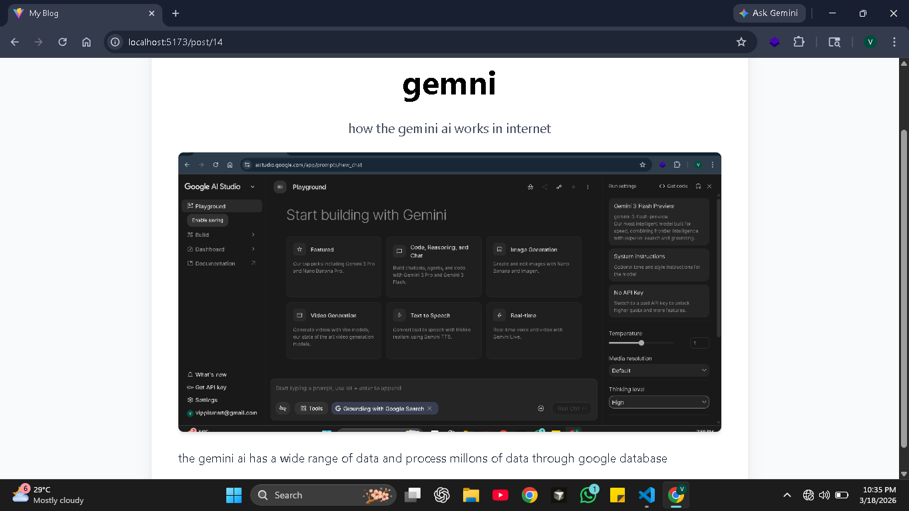
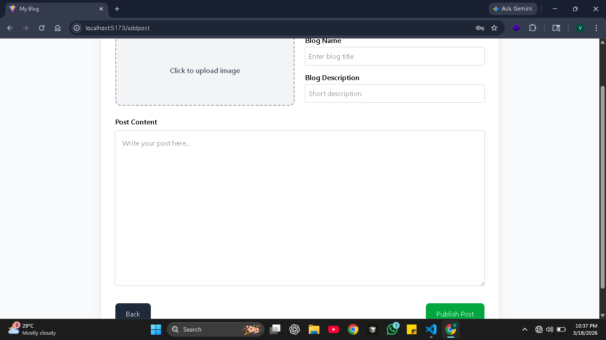
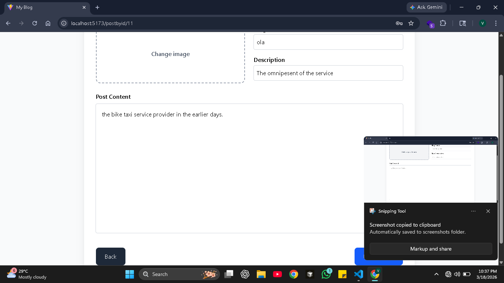
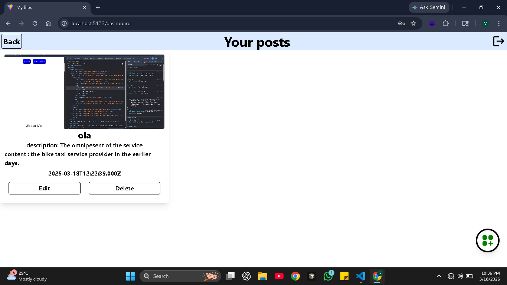
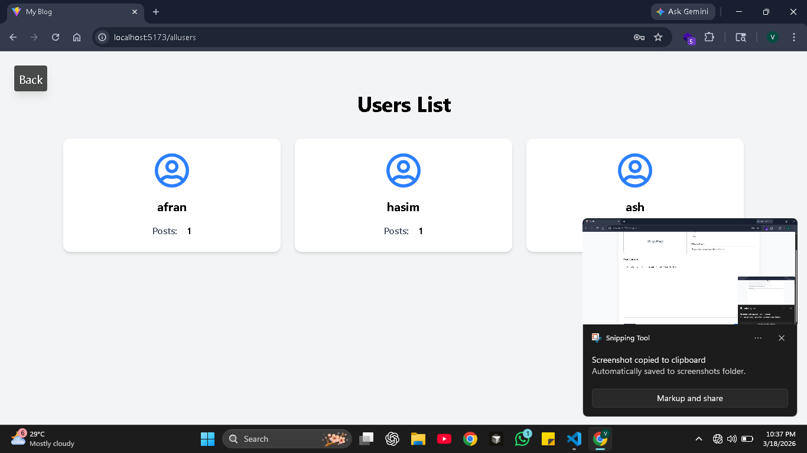

# 📝 Full Stack Blog App (React + Node + MySQL)

A complete full-stack blogging platform built with **React (Vite)** on the frontend and **Node.js + Express + MySQL** on the backend.

---

## 🚀 Features

- Authentication (Login / Signup)
- Create, Edit, Delete blog posts
- Image upload support (Multer)
- Featured posts section
- User dashboard
- Users list with post count
- Search functionality

---

## 🛠 Tech Stack

### Frontend
- React 19 + Vite
- React Router DOM
- Axios
- React Hot Toast
- React Icons
- React Typed

### Backend
- Node.js + Express
- MySQL (mysql2)
- Multer
- Express Session
- CORS
- dotenv

---

## 📸 Screenshots

### 🔐 Login Page


### 🏠 Home Page (Featured Blogs)


### 📰 Blog Details Page


### ➕ Add Post Page


### ✏️ Edit Post Page


### 📊 Dashboard (Your Posts)


### 👥 Users List


---

## 📂 Project Structure
my-blog/
│
├── blog-react/ # Frontend
├── blog-back/ # Backend
└── My-blog/ # Screenshots


---

## ⚙️ Installation

### Clone repo
```bash
git clone https://github.com/your-username/my-blog.git
cd my-blog
cd blog-back
npm install


### create a .env file

```bash
backend setup:
npm run dev
Frontend Setup:
cd blog-react
npm install
npm run dev

